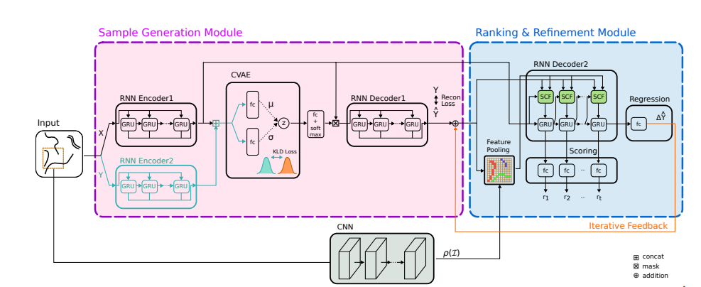

# FLORA

FLORA: Future prediction of obstacle locations in traffic scenes for collision avoidances.

```bash
python3 -m scripts.train               # Trains the model
python3 -m scripts.evaluate_model      # Evaluates a trained model
```
## Improve evaluator
- [ ] Seperate training the oracle (from real data only and/or the trained generator)
- [ ] Learn collisions from videos
- [ ] Learn the value function (collision) by generator.
- [ ] Learn collision checking of oracle
- [ ] Collision checking, discrete or continous collision checking?
- [ ] Change loss functions of Generator and Oracle

## Improve code
- [ ] Organize code: Seperate dataset from model, delete simple lstm, seperate code in scripts, sgan into more folders (better naming)
- [ ] Modify check_accuracy_evaluator in train.py 

## Cluster computing
- [ ] Make kubernetis work

## Improve generator
- [ ] Make graph network, nodes={dynamic object (person), static object (tree/building), infrastructure (traffic light, roundabout, other (zebra))}


## Improve pooling
- [ ] Segmentations correct (not different for same object), use occupancy grids
- [ ] Visualize attention
- [ ] Pool every

## Benchmark
- [ ] DESIRE
- [ ] SeqGAN
- [ ] R2P2
 
## Model 
SafeGAN synergizes generative adversarial networks (GAN) for generating multiple “real” trajectories with a reward network to generate plausible trajectories penalizing collisions. The reward network, Oracle, is environmentally aware to prune trajectories which result in collision.

Our benchmark is against DESIRE and R2P2. These generating models have similar structure (a generating module which takes in the observed trajectories and additional into scene information) and may differ in evaluation module (DESIRE has a seperate module, while R2P2 has an additional loss term). 



