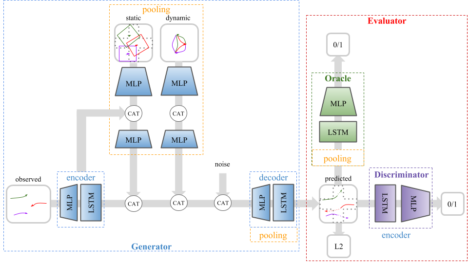

# FLORA

FLORA: Future prediction of obstacle locations in traffic scenes for collision avoidances.

## Improve code
- [ ] Organize code: Seperate dataset from model, delete simple lstm, seperate code in scripts, sgan into more folders (better naming)
- [ ] Refactor train.py (too long)
- [ ] Commit attention model in pooling and physical pooling, maybe remove if statements

## Cluster computing
- [ ] Make kubernetis work

## Improve model performance
- [ ] Pool every
- [ ] Make graph network
- [ ] Learn collision checking of oracle

## Model 
SafeGAN synergizes generative adversarial networks (GAN) for generating multiple “real” trajectories with a reward network to generate plausible trajectories penalizing collisions. The reward network, Oracle, is environmentally aware to prune trajectories which result in collision.

